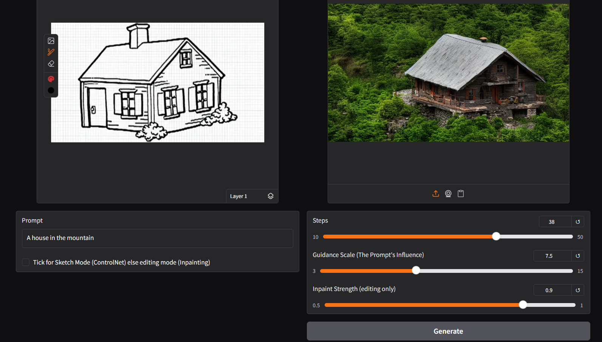
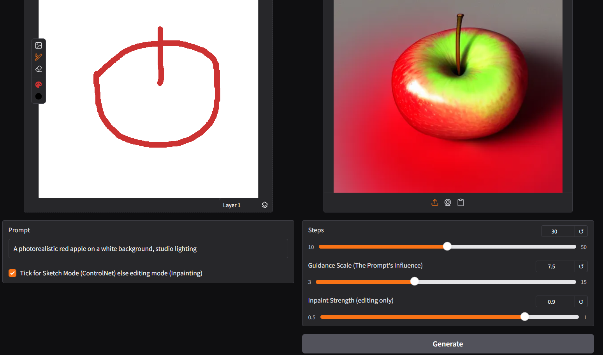

# 🎨 SketchControl-AI: Sketch-Guided Image Generation & Editing

> **Create & edit images from your sketches — powered by Stable Diffusion ControlNet + Inpainting**

---

## 🧠 Overview

**SketchControl-AI** is an interactive web app (built for **Google Colab**) that lets you:
- 🖌️ **Draw a sketch** to generate images using **ControlNet (Scribble)**  
- 🧽 **Edit existing images** using **Stable Diffusion Inpainting**  
- ⚙️ **Customize generation** with prompt text, inference steps, guidance scale, and inpaint strength  

It runs entirely on a **free Colab GPU**, and all interactions are handled via an easy-to-use **Gradio interface**.

---

## 🚀 Features

✅ ControlNet (Scribble) for sketch-based generation  
✅ Stable Diffusion Inpainting for precise editing  
✅ Gradio web interface with image editor  
✅ Customizable parameters (steps, CFG scale, strength)  
✅ Works on free Google Colab GPUs  
✅ Built-in error handling and memory-efficient xFormers support  

---

## 🧩 Model Architecture

- **Base Model:** `runwayml/stable-diffusion-v1-5`  
- **Inpainting Model:** `runwayml/stable-diffusion-inpainting`  
- **ControlNet Model:** `lllyasviel/control_v11p_sd15_scribble`  
- **Scribble Detector:** `lllyasviel/Annotators (HEDdetector)`  

---

## ⚙️ Setup Instructions (Colab)

1. **Open in Google Colab**  
   - Upload your notebook file: `sketch_editor_colab.ipynb`

2. **Change Runtime Type**  
   - Go to `Runtime` → `Change runtime type` → select **GPU**

3. **Run All Cells**  
   - It will automatically:
     - Install dependencies  
     - Load Stable Diffusion + ControlNet models  
     - Launch the Gradio app

4. **Interact via Gradio UI**  
   - Draw a **sketch** (for generation) or upload an **image + mask** (for editing)
   - Enter your **text prompt**
   - Click **Generate / Edit**
   - View and download results directly in the notebook

---

## 🧮 Parameters

| Parameter | Description | Default |
|------------|--------------|----------|
| **Steps** | Number of diffusion steps | `30` |
| **Guidance Scale** | How closely to follow the prompt | `7.5` |
| **Inpaint Strength** | How strongly masked area is modified | `0.9` |
| **Sketch Mode** | Enables ControlNet sketch-based generation | `True` |

---

## 📚 Notebook Overview

**File:** `sketch_editor_colab.ipynb`

This notebook performs:
- Installation of dependencies  
- Loading of ControlNet and Inpainting models  
- Launching a Gradio sketch interface  
- Image generation and editing based on user input  

---

## ⚙️ How to Run

1. Open the notebook directly in **Google Colab**:  
2. Run all cells sequentially  
3. Draw or upload a sketch in the interface  
4. Generate or inpaint your image interactively  

---

## 📸 Example Screenshot

---

## 🧠 Tech Stack

- **Python 3.10+**  
- **Google Colab**  
- **Hugging Face Diffusers**  
- **ControlNet**  
- **PyTorch**  
- **Gradio**

---

## 👨‍💻 Author

**[Somesh Padiyar](https://github.com/SomeshPadiyar)**  
Project: *SketchControl-AI – Sketch Guided Image Generation and Editing*

---

## ⭐ Acknowledgements

- [Stable Diffusion](https://huggingface.co/CompVis/stable-diffusion-v1-4)  
- [ControlNet](https://github.com/lllyasviel/ControlNet)  
- [Hugging Face Diffusers](https://github.com/huggingface/diffusers)  
- [Gradio](https://github.com/gradio-app/gradio)

